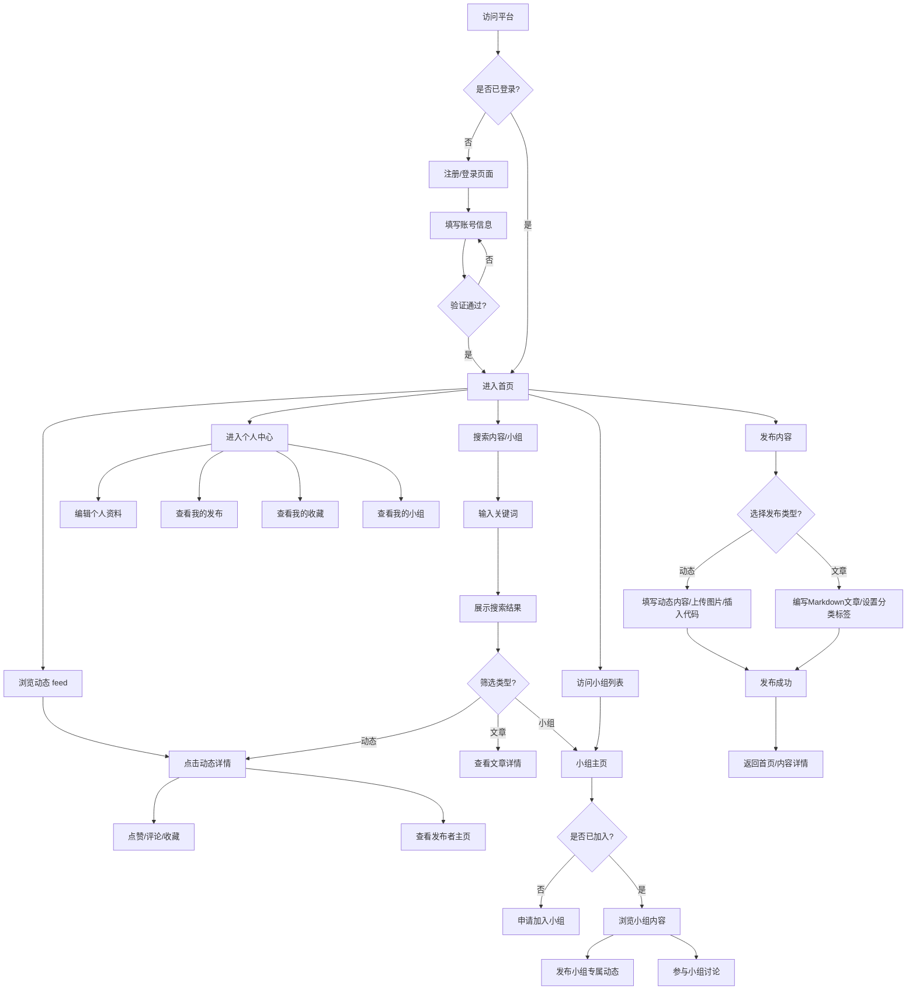
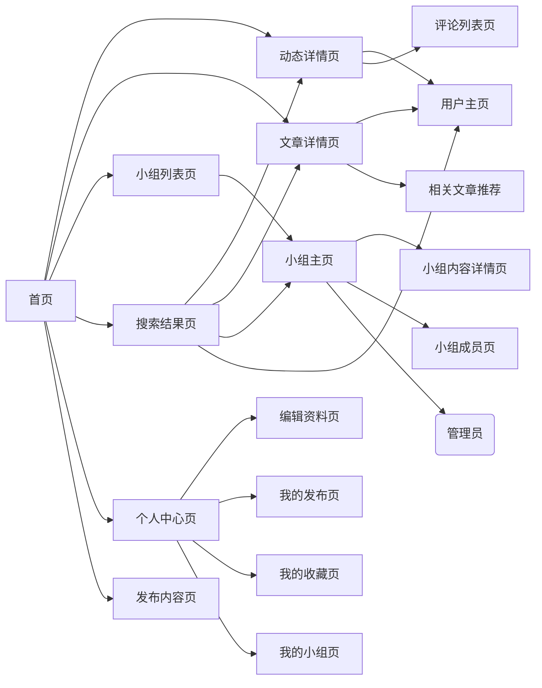

# AI Cultivation 用户交互流程图

## 一、核心用户操作流程

## 二、用户旅程地图

### 1. 新用户旅程
| 阶段 | 操作 | 期望 | 痛点 | 设计优化点 |
|------|------|------|------|------------|
| 访问 | 打开网站 | 快速了解平台价值 | 不知道平台是做什么的 | 首页展示清晰的平台介绍、核心功能演示 |
| 注册 | 填写注册信息 | 注册流程简单快捷 | 表单字段过多、验证复杂 | 支持第三方登录（GitHub/Google），最少仅需用户名+密码 |
| 上手 | 首次登录 | 知道该做什么 | 页面复杂找不到入口 | 新手引导流程，推荐感兴趣的内容和小组 |
| 使用 | 浏览内容 | 找到自己感兴趣的内容 | 内容杂乱无章 | 个性化推荐算法，支持标签订阅 |

### 2. 资深用户旅程
| 阶段 | 操作 | 期望 | 痛点 | 设计优化点 |
|------|------|------|------|------------|
| 创作 | 发布内容 | 发布流程顺畅，支持多种格式 | 编辑器功能有限 | 支持Markdown、代码高亮、图片拖拽上传 |
| 互动 | 参与讨论 | 及时收到互动通知 | 通知不及时、容易遗漏 | 实时通知系统，支持多渠道提醒 |
| 协作 | 小组协作 | 小组内信息同步高效 | 小组功能简单，缺乏协作工具 | 集成任务管理、文件共享功能 |
| 成长 | 个人成长 | 获得平台认可 | 缺乏成长激励体系 | 积分系统、等级勋章、创作者扶持计划 |

## 三、页面跳转关系

