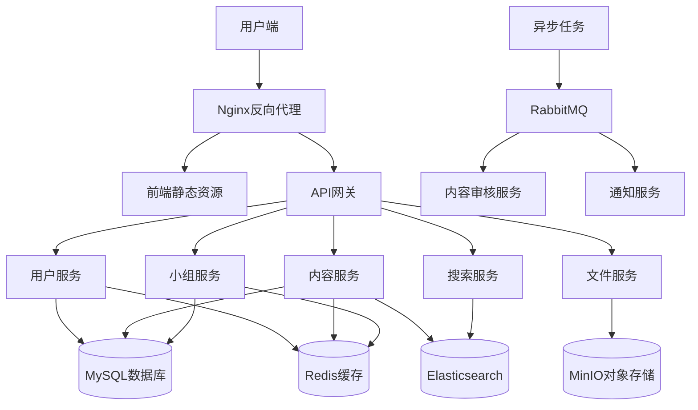
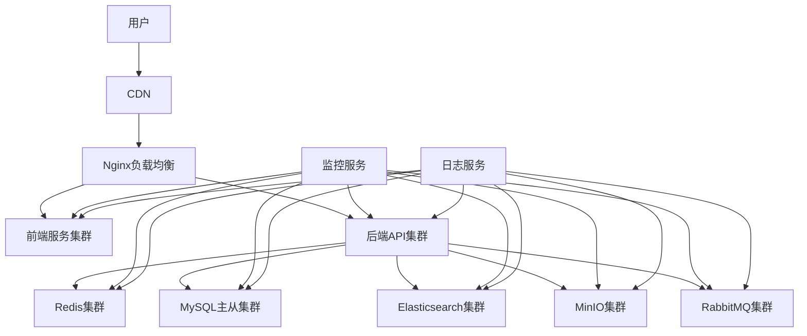

# AI Cultivation 技术架构设计文档

## 一、技术栈选型

### 1. 整体架构选择
采用 **前后端分离 + 微服务架构**，保证系统的可扩展性和可维护性，支持后续功能快速迭代。

---

### 2. 前端技术栈
| 技术栈 | 选型 | 选型理由 |
|--------|------|----------|
| 前端框架 | Vue 3 + TypeScript | 1. 生态成熟，社区资源丰富<br>2. Composition API 适合复杂业务场景开发<br>3. TypeScript 提供类型安全，减少运行时错误 |
| UI 组件库 | Element Plus | 1. 官方支持 Vue 3，组件丰富<br>2. 开箱即用，支持自定义主题，符合UI设计规范 |
| 状态管理 | Pinia | 1. Vue 官方推荐状态管理方案<br>2. 轻量级，API简洁，比Vuex更易维护 |
| 路由 | Vue Router 4 | 官方路由方案，支持路由守卫、懒加载等特性 |
| 构建工具 | Vite | 1. 开发环境启动速度快，热更新效率高<br>2. 生产构建基于Rollup，打包体积小 |
| 富文本编辑器 | Tiptap | 1. 支持Markdown语法，符合文章编辑需求<br>2. 可扩展性强，支持自定义插件 |
| 代码高亮 | highlight.js | 支持多种编程语言代码高亮，适合技术内容展示 |

---

### 3. 后端技术栈
| 技术栈 | 选型 | 选型理由 |
|--------|------|----------|
| 后端框架 | Python FastAPI | 1. 高性能，异步支持，适合高并发场景<br>2. 自动生成OpenAPI文档，接口开发效率高<br>3. Python生态丰富，适合AI相关功能后续扩展 |
| 数据库 | MySQL 8.0 | 1. 关系型数据库，适合存储用户、内容、小组等结构化数据<br>2. 成熟稳定，事务支持完善 |
| 缓存 | Redis 7.0 | 1. 存储用户会话、热点数据、验证码等<br>2. 提升系统响应速度，降低数据库压力<br>3. 支持发布订阅，可用于实时通知功能 |
| 对象存储 | MinIO | 1. 开源轻量级对象存储，兼容S3 API<br>2. 适合存储用户上传的图片、附件等静态资源<br>3. 可自行部署，成本低，扩展性强 |
| 全文搜索 | Elasticsearch | 1. 支持全文检索，适合内容搜索、标签筛选等功能<br>2. 支持高亮、分词、相关性排序等特性 |
| 消息队列 | RabbitMQ | 1. 异步处理非核心业务（如邮件通知、内容审核）<br>2. 削峰填谷，提升系统稳定性 |
| 认证授权 | JWT + OAuth2 | 1. 无状态认证，适合分布式系统<br>2. 支持第三方登录扩展（GitHub、微信等） |

---

### 4. 运维部署技术栈
| 技术栈 | 选型 | 选型理由 |
|--------|------|----------|
| 容器化 | Docker + Docker Compose | 1. 环境一致性，避免"本地运行正常，线上出问题"<br>2. 部署简单，一键启动所有服务 |
| 反向代理 | Nginx | 1. 负载均衡，静态资源服务<br>2. 支持HTTPS、Gzip压缩等特性 |
| 日志收集 | ELK Stack | 1. 统一日志收集、存储、查询<br>2. 方便问题排查和性能分析 |
| 监控 | Prometheus + Grafana | 1. 系统 metrics 监控，实时掌握系统运行状态<br>2. 异常告警，及时发现问题 |

---

## 二、系统架构设计

### 1. 整体架构图


---

### 2. 服务拆分说明
| 服务名称 | 职责范围 |
|----------|----------|
| 用户服务 | 用户注册、登录、个人资料管理、权限认证 |
| 内容服务 | 动态发布、评论、点赞、收藏、文章管理 |
| 小组服务 | 小组创建、成员管理、小组内容发布、权限管理 |
| 搜索服务 | 全文检索、标签筛选、热门榜单 |
| 文件服务 | 图片上传、附件管理、对象存储操作 |
| 内容审核服务 | 异步审核用户发布的内容，过滤违规信息 |
| 通知服务 | 邮件通知、站内信、系统消息推送 |

---

## 三、部署架构设计

### 1. 部署架构图


---

### 2. 环境划分
| 环境 | 用途 | 访问地址 |
|------|------|----------|
| 开发环境 | 开发人员本地调试 | dev.ai-cultivation.com |
| 测试环境 | 功能测试、集成测试 | test.ai-cultivation.com |
| 生产环境 | 线上正式运行 | ai-cultivation.com |

---

## 四、接口设计规范

### 1. RESTful API 规范
- **协议**：HTTPS
- **版本控制**：API路径包含版本号，如 `/api/v1/`
- **请求方法**：
  - GET：查询资源
  - POST：创建资源
  - PUT：更新资源
  - DELETE：删除资源
- **响应格式**：统一JSON格式
  ```json
  {
    "code": 200,
    "message": "success",
    "data": {}
  }
  ```
- **状态码**：
  - 200：成功
  - 400：请求参数错误
  - 401：未认证
  - 403：无权限
  - 404：资源不存在
  - 500：服务器内部错误

---

### 2. 核心接口示例

#### 用户模块
| 接口 | 方法 | 描述 |
|------|------|------|
| `/api/v1/user/register` | POST | 用户注册 |
| `/api/v1/user/login` | POST | 用户登录 |
| `/api/v1/user/profile` | GET | 获取用户信息 |
| `/api/v1/user/profile` | PUT | 更新用户信息 |

#### 内容模块
| 接口 | 方法 | 描述 |
|------|------|------|
| `/api/v1/posts` | GET | 获取动态列表 |
| `/api/v1/posts` | POST | 发布动态 |
| `/api/v1/posts/:id` | GET | 获取动态详情 |
| `/api/v1/posts/:id/like` | POST | 点赞动态 |
| `/api/v1/posts/:id/comment` | POST | 评论动态 |

#### 小组模块
| 接口 | 方法 | 描述 |
|------|------|------|
| `/api/v1/groups` | GET | 获取小组列表 |
| `/api/v1/groups` | POST | 创建小组 |
| `/api/v1/groups/:id` | GET | 获取小组详情 |
| `/api/v1/groups/:id/join` | POST | 加入小组 |
| `/api/v1/groups/:id/posts` | GET | 获取小组内容列表 |

---

## 五、数据库设计概览

### 1. 核心表结构

#### 用户表 `user`
| 字段 | 类型 | 描述 |
|------|------|------|
| id | bigint | 主键 |
| username | varchar(50) | 用户名 |
| email | varchar(100) | 邮箱 |
| password | varchar(255) | 加密密码 |
| avatar | varchar(255) | 头像URL |
| bio | text | 个人简介 |
| created_at | datetime | 创建时间 |
| updated_at | datetime | 更新时间 |

#### 动态表 `post`
| 字段 | 类型 | 描述 |
|------|------|------|
| id | bigint | 主键 |
| user_id | bigint | 发布用户ID |
| title | varchar(255) | 标题 |
| content | text | 内容 |
| images | json | 图片列表 |
| tags | json | 标签列表 |
| like_count | int | 点赞数 |
| comment_count | int | 评论数 |
| created_at | datetime | 创建时间 |
| updated_at | datetime | 更新时间 |

#### 小组表 `group`
| 字段 | 类型 | 描述 |
|------|------|------|
| id | bigint | 主键 |
| name | varchar(100) | 小组名称 |
| description | text | 小组介绍 |
| avatar | varchar(255) | 小组头像 |
| owner_id | bigint | 群主ID |
| is_public | tinyint | 是否公开 |
| member_count | int | 成员数 |
| created_at | datetime | 创建时间 |
| updated_at | datetime | 更新时间 |

---

## 六、架构风险及规避方案

### 1. 性能风险
**风险**：用户量增长后，数据库查询压力大，响应变慢
**规避方案**：
- 热点数据使用Redis缓存
- 数据库读写分离
- 接口限流降级
- Elasticsearch分担搜索查询压力

### 2. 安全风险
**风险**：用户数据泄露、违规内容传播
**规避方案**：
- 用户密码bcrypt加密存储
- 接口参数校验，防止SQL注入、XSS攻击
- 内容异步审核机制，过滤违规内容
- HTTPS传输，接口签名验证

### 3. 可扩展性风险
**风险**：后续功能迭代困难，架构无法支撑新需求
**规避方案**：
- 微服务拆分，各服务独立部署迭代
- 前后端完全分离，前端后端并行开发
- 接口版本控制，保证向后兼容
- 异步解耦非核心业务，核心业务不受影响

### 4. 可用性风险
**风险**：单点故障导致系统不可用
**规避方案**：
- 服务集群部署，无单点
- 数据库主从复制，故障自动切换
- 监控告警体系，及时发现问题
- 灰度发布，降低上线风险

---

## 七、开发计划建议

### 第一阶段（基础功能）
- 用户系统开发（注册、登录、个人资料）
- 内容发布系统（动态发布、评论、点赞）
- 基础前端页面开发

### 第二阶段（核心功能）
- 小组系统开发
- 文章发布系统
- 搜索功能开发

### 第三阶段（体验优化）
- 内容审核机制
- 消息通知系统
- 性能优化、安全加固

### 第四阶段（扩展功能）
- 移动端适配
- 第三方登录集成
- 数据分析系统